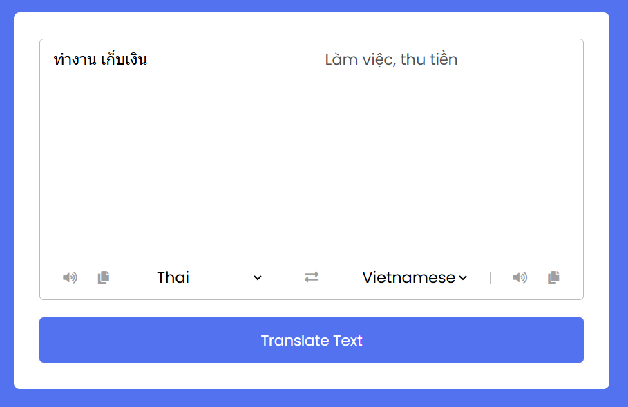

# Translator API ♋️

Welcome to the Text Translator project! This is a simple web application designed to mimic the core functionality of services like Google Translate. The application allows users to input text in one language and translates it into another language using a simple UI built with HTML, CSS, and JavaScript.

## Demo

**Live Demo:** [Translator API](https://nermadie.github.io/Translator_API/)



## Features

- **User-Friendly Interface**: Intuitive design to input text and view translated output.
- **Multiple Languages**: Options to select input and output languages.
- **Realtime Translation**: Translates text as you type using a translation API.

## Getting Started

### Prerequisites

Make sure you have a modern web browser (e.g., Chrome, Firefox) installed to run this project.

### Installation

1. **Clone this repository to your local machine using:**
   ```bash
   git clone https://github.com/nermadie/Translator_API.git
   ```
2. **Navigate to the project directory:**
   ```bash
   cd Translator_API
   ```
   Open index.html in your preferred web browser to run the application.
3. Change the API key in the script.js file to your own API key.

   ```javascript
   let apiURL = `YOUR_API_URL`;
   ```

   **My API key is in the script.js file, you can use it for testing purposes. But it is recommended to use your own API key.**

## Usage

1. Open the index.html file.
2. Select the language you want to translate from and the language you want to translate to.
3. Enter the text you wish to translate in the input box.
4. View the translated text in the output box.

## Technologies Used

- HTML: Structure the user interface and layout.
- CSS: Style the application and provide a responsive design.
- JavaScript: Handle dynamic interactions and call translation APIs.

## How It Works

The application is built primarily with front-end technologies. It requires an external translation API such as Google Translate API, Microsoft Text Translation API, or any other service to perform the actual translation task.

When a user inputs text and selects the languages, an API request is made.
The server returns the translated text, which is then displayed on the page.

## Future Improvements

- Improve Translation Accuracy: Integrate with advanced translation models for better accuracy.
- UI Enhancements: Further improve the design for better user experience.
- Offline Capabilities: Explore options for offline translation.

## Contributing

Contributions are welcome! Please feel free to submit a Pull Request or file an issue.

## License

This project is licensed under the MIT License - see the LICENSE.md file for details.

## Contact

If you have any questions, feel free to reach out to nhatminh10b1@gmail.com.

Happy translating! 😊
